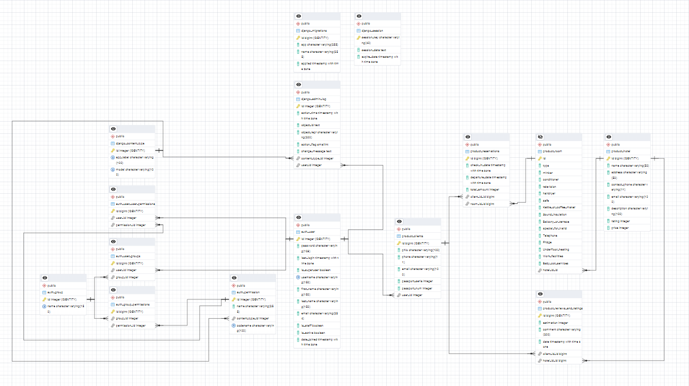

## Содержание  по проекту "Комфорт отель"
[models.py](#models.py)  
[views.py](#views.py)  
[forms.py](#forms.py)  
[urls.py](#urls.py)  
[admin.py](#admin.py)  
[ERD](#erd_diddy)

# <a name="models.py">Model.py от Sergay</a> 

## Создание  таблиц в базе данных

#### Импорты
```
from django.db import models
from django.core.validators import MaxValueValidator, MinValueValidator
from django.contrib.auth.models import User
from django.core.exceptions import ValidationError
```

#### Cоздание таблицы  Hotel

```
class Hotel(models.Model):
    name = models.CharField('Название', max_length=50)
    address = models.CharField('Адрес', max_length=50)
    contact_phone = models.CharField('Контактный номер', max_length=11)
    email = models.CharField('Email', max_length=100)
    description = models.CharField('Описание', max_length=100)
    rating = models.PositiveSmallIntegerField(validators=[MinValueValidator(0), MaxValueValidator(5)], default=0)
    price = models.IntegerField('Цена')
```
#### вывод данных в браузер для таблицы Отель
```
    def __str__(self):
        return self.name
```
#### подмена  названий на Отель, Отели
```
    class Meta:
        verbose_name = 'Отель'
        verbose_name_plural = 'Отели'
```
## Выбор комнаты по её типу
```
class Room(models.Model):
    ROOM_TYPE_CHOICES = [
        (0, 'Одноместный'),
        (1, 'Двуместный'),
        (2, 'Люкс'),
    ]
```
#### параметры для комнаты
```
    hotel_id = models.ForeignKey(Hotel, on_delete=models.CASCADE, verbose_name='Отель')
    type = models.IntegerField('Тип комнаты', choices=ROOM_TYPE_CHOICES)
    minbar = models.BooleanField('Мини-Бар', default=True)
    conditioner = models.BooleanField('Кондиционер', default=True)
```
#### вывод данных в браузер для таблицы Room
```
    def __str__(self):
        # Получаем человекочитаемое название типа комнаты
        return f"{self.get_type_display()} (Отель: {self.hotel_id.name})"
```    
#### подмена  названий на Комната, Комнаты
```  
    class Meta:
        verbose_name = 'Комната'
        verbose_name_plural = 'Комнаты'
```
## Таблица Clients
```
class Clients(models.Model):
    user = models.OneToOneField(User, on_delete=models.CASCADE)  
    phio = models.CharField('ФИО', max_length=100)
    phone = models.CharField('Телефонный номер', max_length=11)
    email = models.CharField('Email', max_length=100)
    passport_seria = models.IntegerField('Серия паспорта')
    passport_num = models.IntegerField('Номер паспорта')
```
#### вывод данных в браузер для таблицы Clients
```
    def __str__(self):
        return self.phio
```
#### подмена  названий на Клиент, Клиенты
```
    class Meta:
        verbose_name = 'Клиент'
        verbose_name_plural = 'Клиенты'
```

## таблица Reservations
```
class Reservations(models.Model):
    client_id = models.ForeignKey(Clients, on_delete=models.CASCADE, verbose_name='Клиент')
    room_id = models.ForeignKey(Room, on_delete=models.CASCADE, verbose_name='Комната')
    check_in_date = models.DateTimeField('Дата заезда')
    departure_date = models.DateTimeField('Дата выезда')
    total_amount = models.IntegerField('Общая сумма')
```
#### вывод данных в браузер для таблицы Reservations
```
    def __str__(self):
        return f"Бронирование #{self.id} - {self.client_id.phio}"
```
#### подмена  названий на Бронирование, Бронирования
```
    class Meta:
        verbose_name = 'Бронирование'
        verbose_name_plural = 'Бронирования'
```

## таблица Reviews_and_ratings
```
class Reviews_and_ratings(models.Model):
    client_id = models.ForeignKey(Clients, on_delete=models.CASCADE, verbose_name='Клиент')
    hotel_id = models.ForeignKey(Hotel, on_delete=models.CASCADE, verbose_name='Отель')
    estimation = models.IntegerField('Оценка', validators=[MinValueValidator(1), MaxValueValidator(5)])
    comment = models.CharField('Комментарий', max_length=200)
    date = models.DateTimeField('Дата публикации', auto_now_add=True)
```
#### функци проверки корректности введённой даты
```
    def clean(self):
      if self.departure_date <= self.check_in_date:
        raise ValidationError("Дата выезда должна быть позже даты заезда")
```
#### вывод данных в браузер для таблицы Reviews_and_ratings
```
    def __str__(self):
        return self.client_id
```
#### подмена  названий на Отзывы и оценки
```
    class Meta:
        verbose_name = 'Отзыв и оценка'
        verbose_name_plural = 'Отзывы и оценки'
```

# <a name="views.py">Views.py от Sergay</a> 

#### импорт перенаправления на страницы сайта
```
from django.shortcuts import render, redirect, get_object_or_404
from django.contrib.auth.decorators import login_required
from django.contrib.auth import authenticate, login, logout
from .models import Hotel, Room, Clients, Reservations, User
from django.contrib import messages
from .forms import RegisterForm, LoginForm
from django.core.exceptions import ObjectDoesNotExist
```
#### ссылки на страницы сайта
```
def hotel(request):
    return render(request, 'hotel/index.html')
```
####
```
def hotel_info(request):
    return render(request, 'hotel/hotel_info.html')
```
####
```
def booking(request):
    return render(request, 'hotel/booking.html')
```
####
```
def booking_info(request):
    return render(request, 'hotel/booking_info.html')
```
####
```
def login(request):
    return render(request, 'registration/login.html')
```
####
```
def register(request):
    return render(request, 'registration/register.html')
```
####
```
def profile(request):
    return render (request, 'profile/user.html')
```
#### получение данных об отеле из таблицы Hotel
```
def hotel(request):
    hotel = Hotel.objects.all()
    return render(request, 'hotel/index.html', {'hotel': hotel})
```
#### получение данных о комнате из таблицы Hotel
```
def hotel_info(request):
    hotel_info = Room.objects.all()
    return render(request, 'hotel/hotel_info.html', {'hotel_info': hotel_info})
```
#### получение информации об отеле по id или при отсутствие выводит ошибку
```
def hotel_info(request, id):
    hotel = get_object_or_404(Hotel, id=id)  # Получаем отель по ID
    return render(request, 'hotel/hotel_info.html', {'hotel': hotel})
```
#### получение информации о бронировнии по id или при отсутствие выводит ошибку и перенаправляет на hotel/booking.html страничку
```
def booking(request, id):
    hotel = get_object_or_404(Hotel, id=id)  # Получаем отель по ID
    return render(request, 'hotel/booking.html', {'hotel': hotel})
```
#### получение информации о бронировнии по id или при отсутствие выводит ошибку и перенаправляет на hotel/booking_info.html  страничку
```
def booking_info(request, id):
    hotel = get_object_or_404(Hotel, id=id)  # Получаем отель по ID
    return render(request, 'hotel/booking_info.html', {'hotel': hotel})
```

# <a name="forms.py">forms.py от Sergay</a>
#### импорт из django необходимых модулей для создания форм 
```
from django import forms
from django.contrib.auth.forms import UserCreationForm
from django.contrib.auth.forms import AuthenticationForm
```
#### формы для входа на сайт
```
class LoginForm(AuthenticationForm):
    username = forms.CharField(label='Телефон или Email')
    password = forms.CharField(label='Пароль', widget=forms.PasswordInput)
```
#### формы для регистрациии на сайте
```
class RegisterForm(UserCreationForm):
    phio = forms.CharField(label='ФИО', max_length=100, required=True)
    phone = forms.CharField(label='Телефон', max_length=11, required=True)
    email = forms.EmailField(label='Email', required=True)
    passport_seria = forms.IntegerField(label='Серия паспорта', required=True)
    passport_num = forms.IntegerField(label='Номер паспорта', required=True)
```
#### заполнение полей из формы
```
    class Meta(UserCreationForm.Meta):
        fields = ('username', 'email', 'password1', 'password2',
                 'phio', 'phone', 'passport_seria', 'passport_num')
```

# <a name="urls.py">Urls.py от Sergay</a> 

#### импорт из views.py
```
from django.urls import path
from . import views
```
#### вариации ссылок на страницы 
```
urlpatterns = [
    path('', views.hotel, name = 'hotel'),
    path('hotel_info/<int:id>/', views.hotel_info, name='hotel_info'),
    path('booking/<int:id>/', views.booking, name = 'booking'),
    path('booking_info/<int:id>/', views.booking_info, name = 'booking_info'),
    path('login/', views.login, name = 'login'),
    path('register/', views.register, name = 'register'),
    path('profile/', views.profile, name = 'profile'),
]
```

# <a name="admin.py">admin.py от Sergay</a> 

#### импортируем из файла .models наши таблицы
```
from django.contrib import admin
from .models import Hotel, Room, Clients, Reservations, Reviews_and_ratings
```
#### вывод таблицы на странице адмиинистратора django
```
admin.site.register(Hotel)
admin.site.register(Room)
admin.site.register(Clients)
admin.site.register(Reservations)
admin.site.register(Reviews_and_ratings)
```

### ER-диаграмма<a name="erd_diddy" style="border: 2px solid black;"></a> 